# Enhancing Pediatric Pneumonia Detection through GAN-Based Data Augmentation

## Project Overview
The project aims to enhance the identification of pediatric pneumonia utilizing a unique method of addressing data imbalance using GAN-based data augmentation. The project involves:
1. Building a Generative Adversarial Network (GAN) for data augmentation to address class imbalance
2. Building and training a Convolutional Neural Network (CNN) for detecting pneumonia in chest X-ray images.
3. Fine-tuning a pre-trained convolutional neural network (VGG16) for detecting pneumonia in chest X-ray images.

- **Flow Diagram**:  
  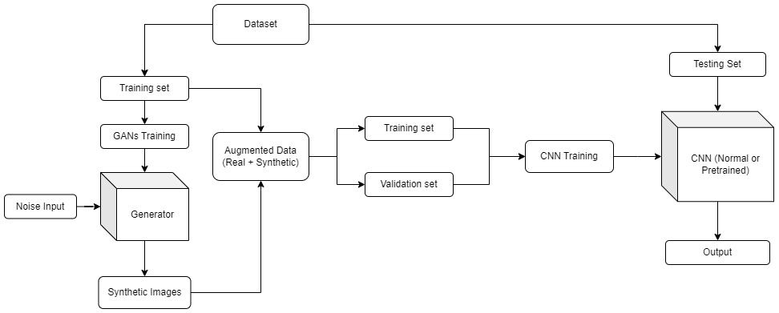

## Results Summary

### 1. **CNN Model:**
- **Accuracy**: 96%
- **Precision (Class 0)**: 93% | **Precision (Class 1)**: 97%
- **Recall (Class 0)**: 91% | **Recall (Class 1)**: 98%
- **F1-Score (Class 0)**: 92% | **F1-Score (Class 1)**: 97%

  The CNN model shows excellent performance in classifying pneumonia and non-pneumonia cases with high precision, recall, and F1-score, making it highly suitable for this task.

### 2. **VGG16 Model:**
- **Accuracy**: 93%
- **Precision (Class 0)**: 82% | **Precision (Class 1)**: 97%
- **Recall (Class 0)**: 93% | **Recall (Class 1)**: 93%
- **F1-Score (Class 0)**: 87% | **F1-Score (Class 1)**: 95%
  
  The VGG16 model, using transfer learning, provides strong results, though it slightly lags behind the CNN in terms of precision for Class 0 (non-pneumonia). However, it still offers competitive performance with a 93% accuracy.

## Directory Structure

The directory structure of the project is as follows:

```
.
├── data/
│   ├── .gitignore                       # Specifies files to ignore in the data folder
│   └── README.md                        # Instructions on downloading datasets
├── diagrams/
│   ├── CNN_Architecture_1.png           # CNN Architecture Diagram 1
│   ├── CNN_Architecture_2.png           # CNN Architecture Diagram 2
│   ├── Discriminator_Architecture.png   # Discriminator Architecture Diagram
│   ├── Flow_Diagram.png                 # Overall Flow Diagram of the Model
│   ├── GAN_Architecture.png             # GAN Architecture Diagram
│   ├── Generator_Architecture.png       # Generator Architecture Diagram
│   └── VGG16_Architecture.png           # VGG16 Architecture Diagram
├── models/
│   ├── CNN_model.h5                     # Saved CNN model
│   ├── finetuned_VGG16.h5               # Saved fine-tuned VGG16 model
│   ├── generator-1000.h5                # Pre-trained Generator Model (1000 iterations)
│   └── generator-500.h5                 # Pre-trained Generator Model (500 iterations)
├── notebooks/
│   ├── Chest_Xray_GAN.ipynb             # Jupyter notebook for training GAN
│   ├── GANs_training_continued.ipynb    # Jupyter notebook for continued GAN training
│   └── Pneumonia_Detection.ipynb        # Jupyter notebook for pneumonia detection model training
├── results/
│   ├── CNN_classification_report.png    # CNN classification report
│   ├── CNN_confusion_matrix.png         # CNN confusion matrix
│   ├── CNN_train_val_acc.png            # CNN training vs validation accuracy plot
│   ├── CNN_train_val_loss.png           # CNN training vs validation loss plot
│   ├── GAN_performance.png              # Performance of GAN over the iterations
│   ├── VGG16_classification_report.png  # VGG16 classification report
│   ├── VGG16_confusion_matrix.png       # VGG16 confusion matrix
│   ├── VGG16_train_val_acc.png          # VGG16 training vs validation accuracy plot
│   └── VGG16_train_val_loss.png         # VGG16 training vs validation loss plot
├── .gitignore                           # Specifies files to ignore in the repository
└── README.md                            # Project Overview
```

## Dataset

The dataset contains 5856 chest xray images of pediatric patients of one to five years old which were collected as part of patients’ routine clinical care at Guangzhou Women and Children’s Medical Centre, Guangzhou. There are 1583 images of the normal class and 4273 images of the pneumonia class in the dataset. 

   Please follow the instructions in the `README.md` file inside the `data/` folder to download the dataset.

## Class Imbalance and Utilizing GANs for Data Augmentation

It is observed from the dataset that the pneumonia class has
three times as many images as the normal class, which
contributes to the issue of data imbalance. If this problem is not resolved, models may become heavily biased and show a significant preference for the majority class, which could impair the models' capacity to recognize the minority “normal” class. In order to provide the model an equal exposure to both classes and help it acquire the comprehensive and discriminative features necessary for accurately differentiating between pneumonia and normal cases, it is important that this imbalance be corrected.

The project uses DCGAN to augment the normal class and generate synthetic samples in order to correct the data imbalance in the dataset and make its population equal to that of the pneumonia class.

- **GAN Architecture and Flow**:  
  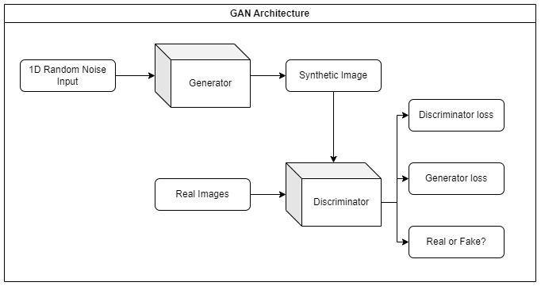
  
- **Generator Architecture**:  
  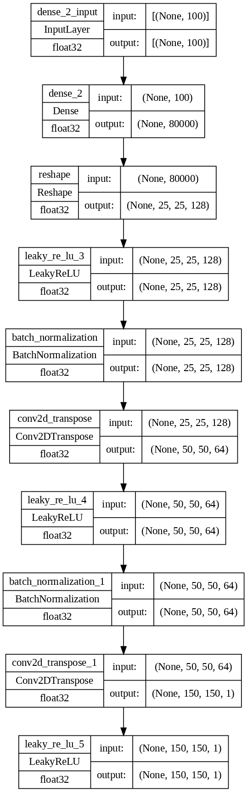

- **Discriminator Architecture**:  
  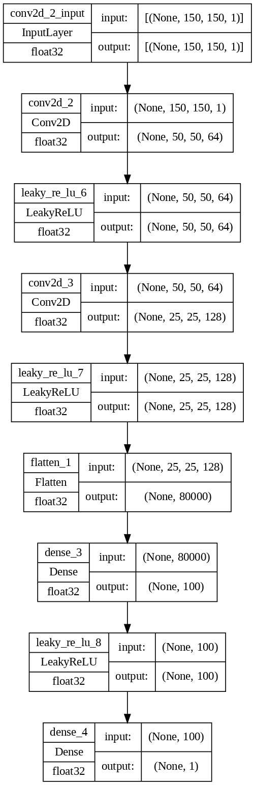

## Models Used for Pneumonia Detection

The project leverages several deep learning models to detect pneumonia from chest X-ray images. The following models have been used:

#### 1. **Convolutional Neural Network (CNN)**

CNN is the primary model used for pneumonia detection. It is a class of deep neural networks specifically designed for analyzing visual imagery. The model has the following components:

- **Convolutional Layers**: These layers help the model to automatically learn spatial hierarchies of features from images. Filters (kernels) slide over the input image to capture important features like edges, textures, and shapes.
- **Activation Functions**: ReLU (Rectified Linear Unit) is used in this model to introduce non-linearity and help the model learn complex patterns.
- **Pooling Layers**: Max pooling is used to downsample the feature maps, reducing the dimensionality and retaining the most important features.
- **Fully Connected Layers**: After the convolutional layers, the model flattens the output and passes it through fully connected layers to make the final classification decision.
- **Dropout**: Dropout layers are applied to reduce overfitting by randomly setting a fraction of input units to zero during training.


  **CNN Architecture**:  
  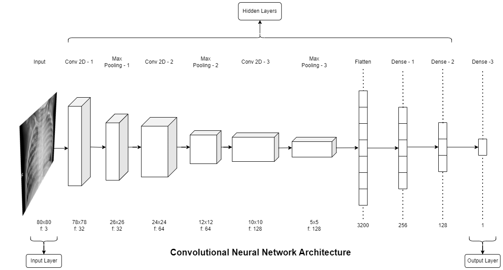

The CNN model is trained using the chest X-ray images and performs binary classification (pneumonia or not pneumonia).

#### 2. **VGG16 (Transfer Learning Model)**

VGG16 is a pre-trained convolutional neural network model that is used in the project through transfer learning. The architecture of VGG16 is based on very deep networks with small convolutional filters. Key features of VGG16 include:

- **Pre-trained Weights**: The model is pre-trained on the ImageNet dataset, which allows it to learn a rich set of features that can be applied to various image recognition tasks, including pneumonia detection. By using this pre-trained model, we avoid the need to train a model from scratch.
- **Frozen Layers**: In this model, the initial layers of VGG16 are frozen (i.e., their weights are not updated during training), allowing the model to retain the pre-learned features. The final layers are fine-tuned on the pneumonia dataset to adapt the model to the specific task.
- **Fully Connected Layers**: The final layers of VGG16 are modified to output a binary classification: pneumonia or not pneumonia. Dropout layers are used to prevent overfitting.

The VGG16 model is fine-tuned to improve its performance on the pneumonia detection task. The fine-tuning process involves unfreezing the top layers of the pre-trained VGG16 model and retraining those layers on the pneumonia dataset. This enables the model to learn more task-specific features that are more relevant to the pneumonia detection task.


## Summary of Models

- **CNN**: A custom deep learning model designed specifically for pneumonia detection.
- **VGG16 (Transfer Learning)**: A pre-trained deep learning model that uses transfer learning to fine-tune a model for pneumonia detection.
- **GANs**: Used for data augmentation, generating synthetic images to balance the dataset and improve model robustness.

These models, when combined, provide a powerful pipeline for detecting pneumonia from chest X-ray images.

## Results

The following results were collected during the training and evaluation of the models:

- **Performance of GAN over the iterations**:  
  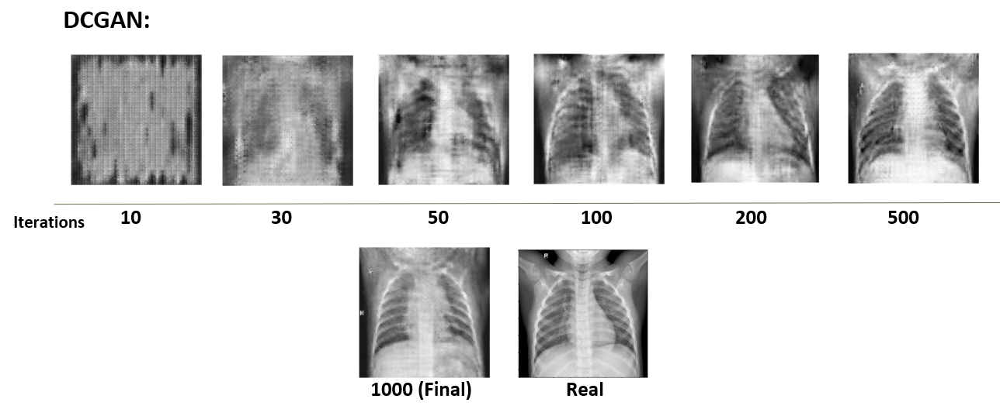

- **CNN Classification Report**:  
  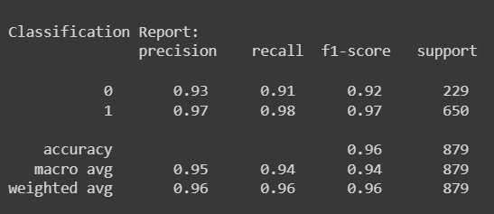

- **CNN Confusion Matrix**:  
  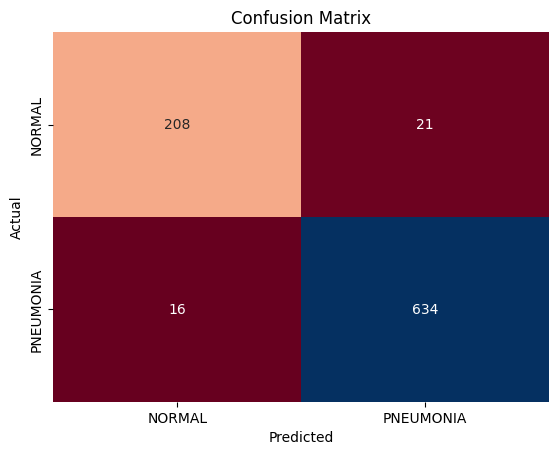

- **CNN Training vs Validation Accuracy**:  
  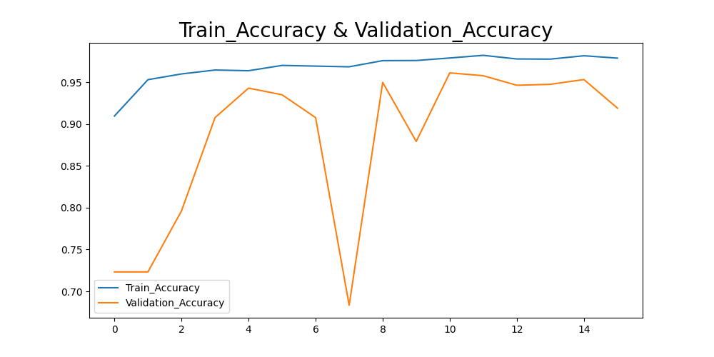

- **CNN Training vs Validation Loss**:  
  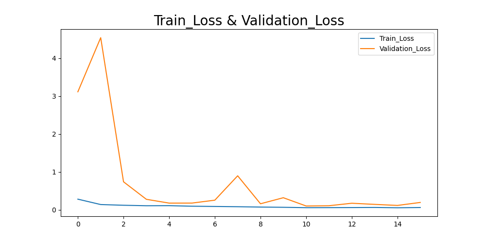

- **VGG16 Classification Report**:  
  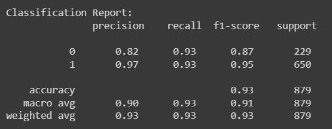

- **VGG16 Confusion Matrix**:  
  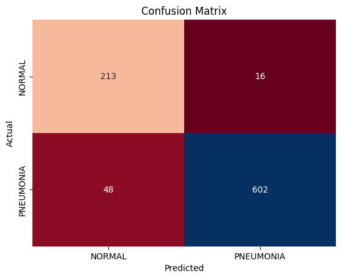

- **VGG16 Training vs Validation Accuracy**:  
  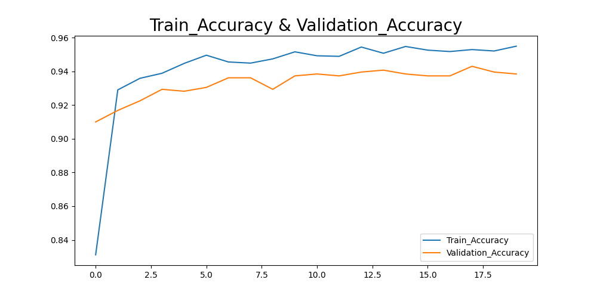

- **VGG16 Training vs Validation Loss**:  
  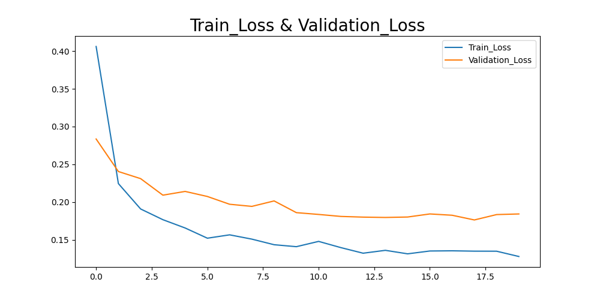

---

